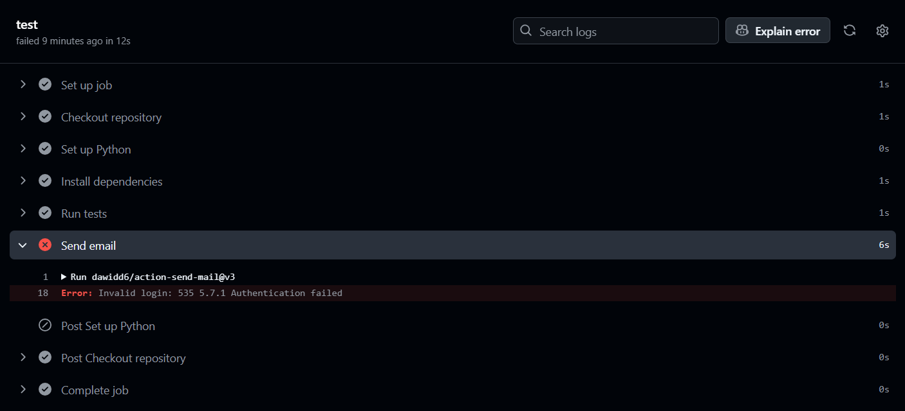

# OSArchiveBuilder
Create a script in Python which permit tobuild an compressed archive with Python tests working with GitHub Actions

To execute the GitHub Action, you need to set two secret variables in your GitHub repository settings after cloning the repository :

**EMAIL_USER** (example : test.test@test.test)
**EMAIL_PASS** (example : MotdePasse1234!)

Difficulties encountred :

Problem from the connection to the SMTP (using for **Gmail** and **Outlook**).

